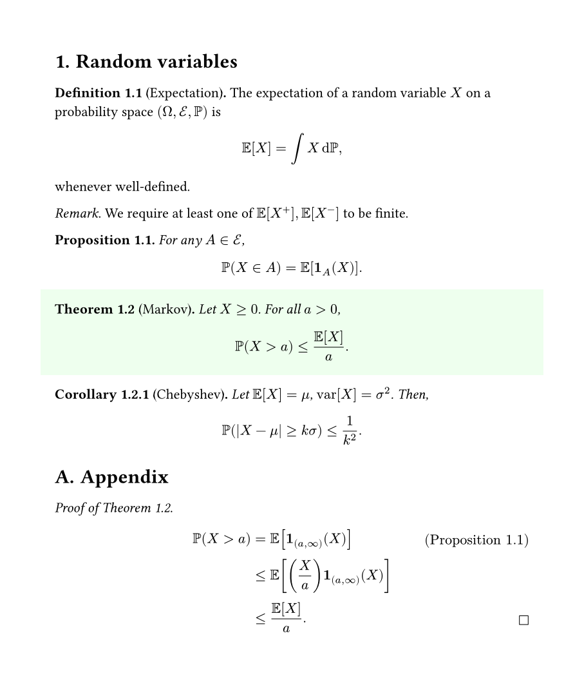

# ctheorems / typst-theorems

An implementation of numbered theorem environments in
[typst](https://github.com/typst/typst).
Available as [ctheorems](https://typst.app/universe/package/ctheorems) in the
official Typst [universe](https://typst.app/universe).
Import with

```typst
#import "@preview/ctheorems:2.0.0": *
#show: thm-rules        // Must include!
```

A standard set of theorem environments in the AMS style is available using
```typst
#import thm-themes.ams: *
```


### Features
A _theorem environment_ combines content with automatically updated _numbering_
information.
Theorem environments can
- share the same counter (_Theorems_ and _Lemmas_ often do so)
- have their counters attached to headings or other environments (_Corollaries_
  are often numbered based upon the parent _Theorem_)
- be `<label>`-ed and `@reference`-d
- be restated or deferred to later in the document.

This package also introduces a few miscellaneous features related to
mathematical writing.
- Proof environments, with _QED_ symbols.
- Equation tags (in the manner of #LATEX's `\tag`).
- Predefined sets of commonly used theorem environments, and a few themes.

## Manual and Examples
Get acquainted with `ctheorems` by checking out the minimal example below!

You can read the [manual](manual.pdf) for a full walkthrough of functionality
offered by this module.



### Preamble
```typst
#import "@preview/ctheorems:2.0.0": *
#import thm-state: thm-restate
#import thm-themes.ams: *
#show: thm-rules.with(qed-symbol: $square$)

#set page(width: 16cm, height: auto, margin: 1.5cm)
#set heading(numbering: "1.")
#show heading: set block(below: 1em)

#let theorem = theorem.with(
  outset: 1em,
  spacing: 2em,
  fill: rgb("#eeffee"),
)
```

### Document
```typst
= Random variables

#definition[Expectation][
  The expectation of a random variable $X$ on a probability space $(Omega, cal(E), PP)$ is $
    EE[X] = integral X dif PP,
  $ whenever well-defined.
] <expectation>

#remark[
  We require at least one of $EE[X^+], EE[X^-]$ to be finite.
]

#proposition[
  For any $A in cal(E)$, $
    PP(X in A) = EE[bold(1)_A (X)].
  $
] <prob-exp>

#theorem[Markov][
  Let $X >= 0$. For all $a > 0$, $
    PP(X > a) <= EE[X] / a.
  $
] <markov>
#proof([of @markov], defer: true)[
  $
    PP(X > a)
      &= EE[bold(1)_((a, oo))(X)]   #tag[(@prob-exp)] \
      &<= EE[(X / a) bold(1)_((a, oo))(X)] \
      &<= EE[X] / a. #qedhere
  $
]

#corollary[Chebyshev][
  Let $EE[X] = mu$, $"var"[X] = sigma^2$. Then, $
    PP(|X - mu| >= k sigma) <= 1 / k^2.
  $
] <chebyshev>


#counter(heading).update(0)
#set heading(numbering: "A.")
= Appendix

#thm-restate()
```

## Changelog

### v1.1.3

- Fixed alignment and block-breaking issues resulting from breaking changes in
  Typst 0.12.

### v1.1.2

- Introduced the `thmproof` function for creating proof environments.
- Inserting `#qedhere` in a block equation/list/enum item (in a proof) places
  the qed symbol on the same line. The qed symbol can be customized via
  `thmrules`.

### v1.1.1

- Extra named arguments given to a theorem environment produced by `thmbox` (or
  `thmplain`) are passed to `block`.

### v1.1.0

- The `supplement` (for references) is no longer set in `thmenv`. It can be
  passed to the theorem environment directly, along with `refnumbering` to
  control the appearance of `@reference`s.
- Extra named arguments given to `thmbox` are passed to `block`.
- Fixed spacing bug for unnumbered environments.
- Replaced dummy figure with labelled metadata.

### v1.0.0

- Extra named arguments given to a theorem environment are passed to its
  formatting function `fmt`.
- Removed `thmref`, introduced normal `<label>`s and `@reference`s.
- Import must be followed by `show: thmrules`.
- Removed `name: ...` from theorem environments; use `#theorem("Euclid")[]`
  instead of `#theorem(name: "Euclid")[]`.
- Theorems are now wrapped in `figure`s.


## Acknowledgements

Thanks to

- [MJHutchinson](https://github.com/MJHutchinson) for suggesting and
  implementing the `base-level` and `base: none` features,
- [rmolinari](https://github.com/rmolinari) for suggesting and
  implementing the `separator: ...` feature,
- [DVDTSB](https://github.com/DVDTSB) for contributing
  - the idea of passing named arguments from the theorem directly to the `fmt`
    function.
  - the `number: ...` override feature.
  - the `title: ...` override feature in `thm-box`.
- [PgBiel](https://github.com/PgBiel) for fixing breaking changes in version
  updates.
- The authors of the LaTeX packages `amsthm`, `thmtools`, `apxproof`.
- The awesome devs of [typst.app](https://typst.app/) for their support.
